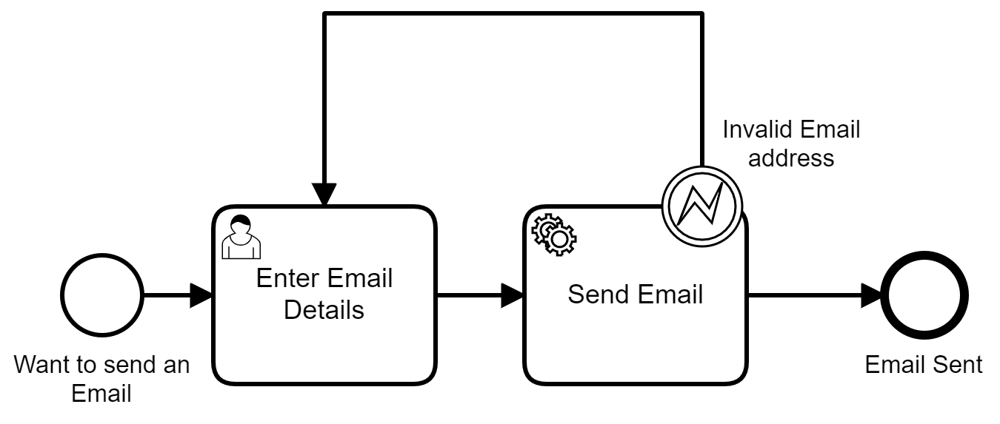

# Send Email Worker Camunda 8 Example

This is an example project that shows how you can send an email using Camunda 8

## Prerequisites

To use this project you need to setup some stuff, some you might already have, but you can follow the requirements list and you'll be all set.

### Camunda 8 Account
Pop along to camunda.io and create a Camunda 8 account. You'll need to create a cluster and setup client connection credentials. If you don't know how to do that, [just follow this tutorial](https://docs.camunda.io/docs/guides/getting-started/).

### Camunda Desktop Modeler (Optional)
You can [download it here](https://camunda.com/download/modeler/) for all the usual platforms.

### Gernate App Password in Email account.
This exmaple was built using a GMAIL account and it's pretty easy to setup a GMAIL account that give access to this worker so that it can send emails. You can follow [this tutorial](https://www.javacodemonk.com/spring-boot-send-email-with-gmail-smtp-5caea8f3) to set it up.

## Configure Worker

Assuming you've already configured the connection to Camunda 8/Zeebe mentioned above you just need to connect to your email server, all of that is done in the `application.yml` file. Replacing the username and password with yours should be all you nee dto do

```yaml
spring.mail:
  host: smtp.gmail.com
  port: 587
  username: yourEmailAddress
  password: YourAppPassword
  properties.mail.smtp:
    auth: true
    starttls.enable: true

```

## What is the Send Email worker doing?

First the worker will subscribe to a specific job or topic, this is determined by the annotation at the top of the class, in this case it's `SendEmail`

```java
    @ZeebeWorker(type = "SendEmail")
  ```

Once a job becomes fetched by the worker it will get the variables it needs from the process and then validate that the email address is indeed valid. If for whatever reason the email address doesn't pass validation, it will send a [BPMN error](https://docs.camunda.io/docs/components/modeler/bpmn/error-events/error-events/) back to the engine. 

```Java
   client.newThrowErrorCommand(job)
                    .errorCode("INVALID_EMAIL")
                    .send();
```

It's then up to the process how it wants to deal with it - it most cases a process should catch this with a [BPMN Error boundary event](https://docs.camunda.io/docs/components/modeler/bpmn/error-events/error-events/). 

If everything is in order the email will be sent and if successful the worker will tell process that the task has been successfully complete, with a variable describing the status.

```Java
 variables.put("result", resultMessage);
 client.newCompleteCommand(job.getKey())
          .variables(variables)
          .send()
          .exceptionally((throwable -> {
               throw new RuntimeException("Could not complete job", throwable);
           }));
```

## Deploy the example process



If you'd like to try out the worker, I've added a simple process that demonstrates all the capabilities.
the fastest way to deploy and start the process is:
1. Go to the `Diagrams` section of your camunda cloud account
1. Create a new diagram
1. Beside the `New Diagram`name there's a menu where you can upload a model.
1. Select the `SendEmail` process from the `ExampleProcess` folder and it should appear.
1. Click the Execute button on the top left.

One you've deployed and started the instance you can go to your Camunda 8 cluster and open up Tasklist, you'll see your task where you can enter the details of your email.


